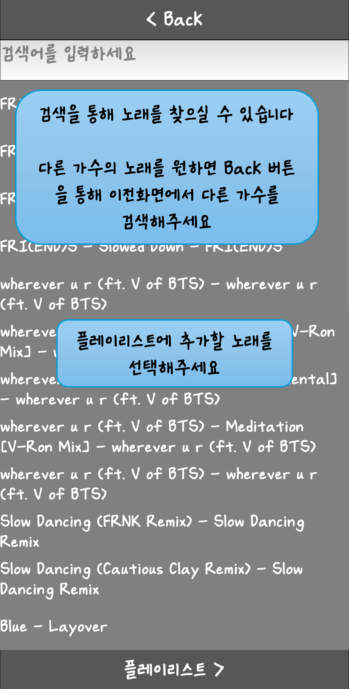
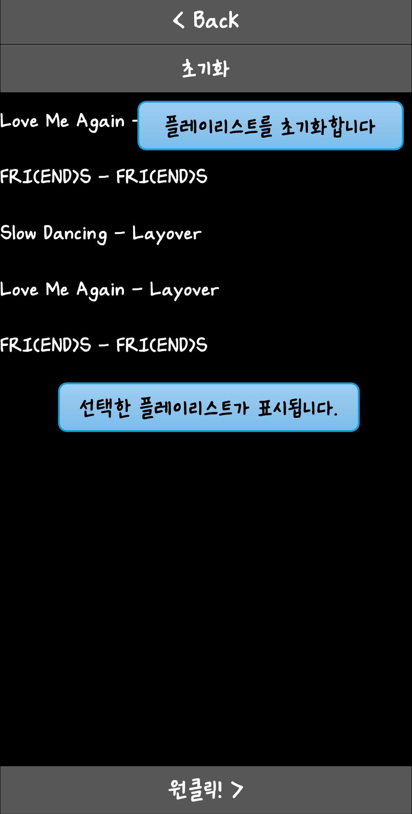
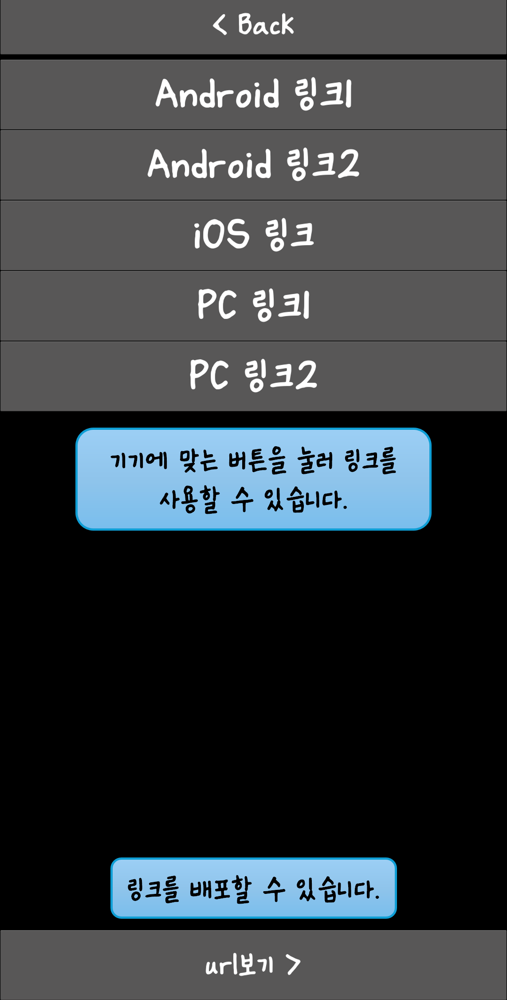
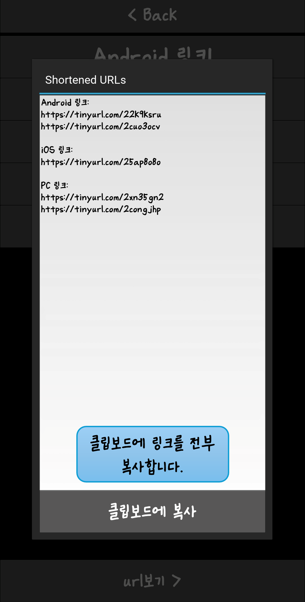

# OneClick

Melon playlist to a single link. Search an artist, tap the songs you want, and the app hands you a `melonapp://` link that loads the whole queue into Melon.

Kivy app packaged for Android. Written in 2024 for an HCI course at Hanyang University.

| Search | Pick songs | Playlist | Links | Shortened |
| --- | --- | --- | --- | --- |
|  |  |  |  |  |

## Why

One-click links weren't new. Idol fandoms had been assembling playlists for the artists they supported and passing the links around for a while, and on the receiving end it works great: one tap and the queue is loaded. Building one is a fiddly manual process, and all of that lands on the person making it.

So the user here isn't whoever clicks the link. It's whoever makes it.

## What it does

Search by artist name. The app hits Melon's search endpoint (`search/keyword/index.json`), takes the artist ID off the first result, then walks that artist's discography 50 songs at a time through `artist/songPaging.htm`, scraping the title, the album, and the song ID out of each row's `playSong('<artistId>',<songId>)` handler.

Tap songs to queue them up. The playlist screen shows the current selection and can clear it. Press OneClick and you get the links.

### Links

They're `melonapp://` deep links, and the scheme differs by platform, so the app emits three sets: Android, iOS, PC.

Duplicates are the awkward case. The Android Melon player won't take the same song twice from a single link, so the selection gets split at every repeat: each run of unique songs becomes its own link, numbered in play order, and you open them in sequence. Android and PC are segmented that way. iOS takes the whole selection in one URL.

Every link on the URL screen is a button that opens Melon directly. There's also a shortener pass that runs all of them through TinyURL and drops the result into one popup with a copy-all button, which is what you actually paste when you hand the playlist to someone.

Artist lookup, song paging and shortening each run on a worker thread with a callback, so the UI stays responsive while Melon is being paged. The `사용법` button in the corner opens the five screens above as an in-app walkthrough.

## Files

| File | What's in it |
| --- | --- |
| `main.py` | The Kivy app: screens, selectable track list, segmentation, link generation, shortening, clipboard |
| `melon_extract_artist_id.py` | Artist name to artist ID |
| `melon_extract_song_info_with_artist_id.py` | Pages an artist's songs, pulling titles, song IDs and album names |
| `OneClick-1.2.apk` | Release build, arm64-v8a and armeabi-v7a |
| `image1.png`–`image5.png` | The in-app walkthrough |

## User study

23 people, recruited through two blog posts that each carried their own Google Form:

- [멜론 원클릭 스트리밍 링크 쉽게 만들기](https://siemarbas.tistory.com/2) — a written walkthrough of the existing manual method
- [멜론 원클릭 스트리밍 앱](https://siemarbas.tistory.com/3) — the APK

87% had used a Melon one-click link before. Everyone answered both surveys with the order counterbalanced: 56.5% did the manual method first, 43.5% started with the app.

Ratings were on a 1–5 scale. The numbers below are means over the 23 responses; the deck itself reported the distributions.

| | Manual method | OneClick |
| --- | --- | --- |
| Easy to understand how to use it | 2.13 | 4.17 |
| Interface felt intuitive | 2.22 | 4.17 |
| Had every function that was needed | 3.65 | 4.26 |
| Met expectations | 3.70 | 4.35 |
| Would use it again | 3.30 | 4.26 |
| Would recommend it to someone else | 2.57 | 4.00 |

And the yes/no items:

| | Manual method | OneClick |
| --- | --- | --- |
| Hit an error while creating the link | 8.7% yes | 0% yes |
| The generated link worked correctly | 91.3% yes | 100% yes |

Two conclusions came out of it: usability improved, and there was demand for extensibility.

## Running it

Install `OneClick-1.2.apk` on an Android device, or run it on the desktop:

```bash
pip install kivy requests beautifulsoup4
python main.py
```

One thing is missing from the repo. The UI hardcodes a Korean font at `./nanayang.ttf`, which isn't committed here, so drop any Korean-capable TTF in beside `main.py` under that name. Comments in `main.py` are in Korean.
